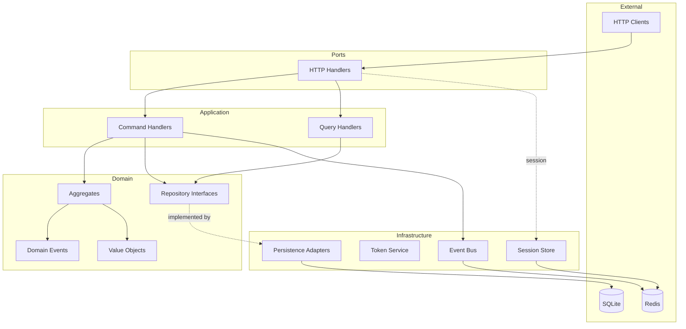

# Architecture

## Hexagonal Architecture Overview

This project is built following **Hexagonal Architecture** (Ports & Adapters) principles with elements of **Domain-Driven Design**.

## Layers

## Dependency Rule

Dependencies go **inward**:
- **Domain** — doesn't depend on anything external
- **Application** — depends only on Domain
- **Infrastructure** — depends on Domain and Application (implements interfaces)
- **Ports** — depend on Application (HTTP handlers call use cases)

## Conventions

### Bounded Contexts
- Each context is a separate package in `internal/`
- **No cross-context imports** between bounded contexts
- Communication between contexts — only through `eventbus.Bus`

### Naming
- Domain: `user.go`, `role.go`, `events.go`, `errors.go`
- Application: `command/register_user.go`, `query/get_user.go`
- Infrastructure: `persistence/user_repository.go`, `token/jwt_service.go`
- Ports: `http/handler.go`, `http/middleware.go`

### Package Structure

- `internal/{context}/`
  - `domain/` - Aggregates, Value Objects, Events, Interfaces
  - `application/` - Command/Query Handlers
    - `command/`
    - `query/`
  - `infrastructure/` - Implementations (DB, external services)
    - `persistence/`
    - `token/`
    - `session/`
  - `ports/` - Entry points (HTTP, gRPC, CLI)
    - `http/`