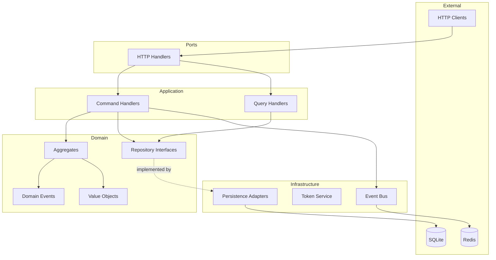

# Architecture

## Hexagonal Architecture Overview

Цей проект побудований за принципами **Hexagonal Architecture** (Ports & Adapters) з елементами **Domain-Driven Design**.

## Layers



## Dependency Rule

Залежності йдуть **всередину**:
- **Domain** — не залежить ні від чого зовнішнього
- **Application** — залежить тільки від Domain
- **Infrastructure** — залежить від Domain та Application (реалізує інтерфейси)
- **Ports** — залежать від Application (HTTP handlers викликають use cases)

## Conventions

### Bounded Contexts
- Кожен контекст — окремий пакет у `internal/`
- **Жодних cross-context імпортів** між bounded contexts
- Комунікація між контекстами — тільки через `eventbus.Bus`

### Naming
- Domain: `user.go`, `role.go`, `events.go`, `errors.go`
- Application: `command/register_user.go`, `query/get_user.go`
- Infrastructure: `persistence/user_repository.go`, `token/jwt_service.go`
- Ports: `http/handler.go`, `http/middleware.go`

### Package Structure
```
internal/{context}/
├── domain/           # Aggregates, Value Objects, Events, Interfaces
├── application/      # Command/Query Handlers
│   ├── command/
│   └── query/
├── infrastructure/   # Implementations (DB, external services)
│   ├── persistence/
│   └── token/
└── ports/            # Entry points (HTTP, gRPC, CLI)
    └── http/
```
